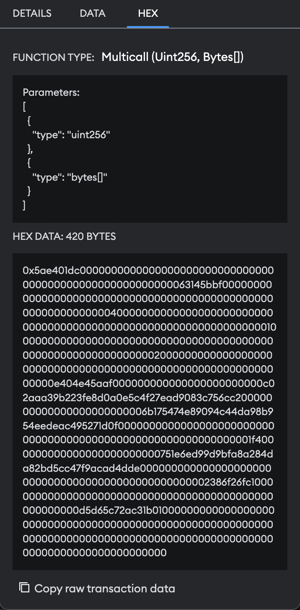
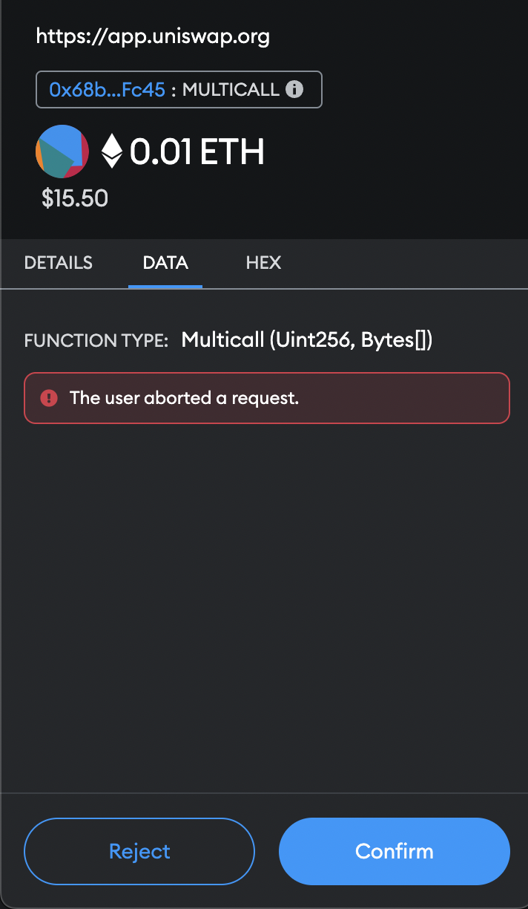

# Vikings team - EthWarsaw Hackathon repository

## Problem We're Solving

In the current flow of metamask, data that user is signing not transparent, being provided with only raw hex data.

This could lead to potential scam or phishing attack.
We are offering a snap, which will improve each user's security by properly decoding and analyzing the calldata. As well as the contract being called.

Ex.
User is performing a transaction of regular transfer:
- Snap should show data to user's transparently
  - Amount of tokens user is sending and to which wallet
- Snap will perform specific actions based on called function
- In case of `transfer`:
  - Perform security analysis of a called token contract.
    - Examine if contract was exploited through advanced techniques
    - Examine if it is verified
    - Check for creation date and number of transactions
    - Compute the trust score based on retrieved data
  - Perform security analysis of a receiver wallet.
    - Examine if wallet was included in exploits before
    - Retrieve all possible metadata

## Client Setup

 - In client directory run:
   - `yarn install && yarn dev`
 - In client/snap directory run:
   - `yarn install && yarn dev`

Metamask extension should be disabled and metamask flask should be added as extension with proper settings.
## Backend Setup

 - Backend contains 2 applications one is written in laravel, the other one in node.js.
 - Both are deployed on heroku.
 - Each service contains one endpoint.

### Node.js App

- Dedicated to retrieving all relevant data from user provided calldata.
  - Discover called function by searching among known selectors.
  - Decoding the arguments.

### Laravel App

- Works as a main backend that our client uses. It contains all the selectors that are currently supported.
- Aggregates data about the transaction, contract and checks the trust score.
- Api uses official etherscan api for getting needed informations about the contract.
